# mkit

A content-addressed version control toolkit written in Rust.

`mkit` is a generic content-addressed VCS — Git-like commits, refs,
transports — plus a native, predicate-agnostic attestation subsystem
(in-toto v1 Statements wrapped in DSSE envelopes) that any downstream
service can attach witness signatures to commits with.

The v1 on-disk and wire formats are pinned by golden vectors under
`rust/tests/golden/`.

## Quick start

Install (see [Installing](#installing) for all four channels):

```sh
cargo install --git https://github.com/officialunofficial/mkit mkit-cli
```

Make your first signed commit:

```sh
mkit init                              # create .mkit/ in the current dir
mkit keygen                            # generate an Ed25519 signing key
echo hello > README.md
mkit add README.md
mkit commit -m "first commit"
```

Then, to push to a remote, declare a strict URL scheme
(`mkit+file://`, `mkit+https://`, `mkit+s3://`, `mkit+ssh://`):

```sh
mkit remote add origin mkit+file:///srv/mkit/my-repo
mkit push
```

See [`docs/CLI.md`](docs/CLI.md) for the full CLI reference.

## Performance

Numbers from `cargo bench --workspace` on an Apple Silicon laptop
(M-class, single core, in-process). The bench harness lives at
`rust/benches/`; charts are generated by `cargo run -p mkit-benches
--bin render-charts` from the bench JSON summaries under
`rust/target/bench-results/`.

### Hashing throughput

mkit uses **BLAKE3** as its content-address primitive, where Git uses
SHA-1 (default) or SHA-256 (experimental). BLAKE3 is the fastest of
the four widely-used cryptographic hashes on this hardware.

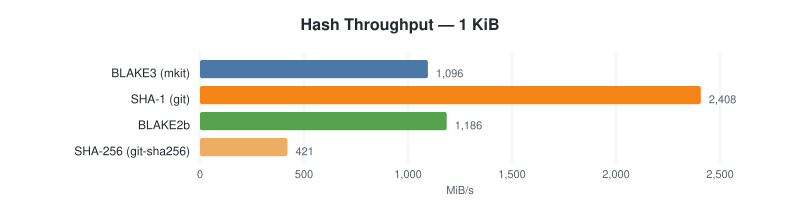
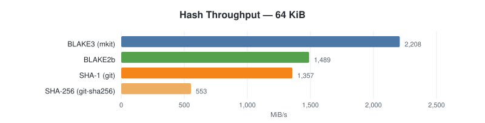
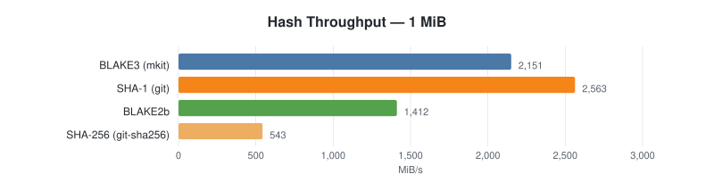


### Signature throughput

Per-algorithm sign + verify ops/s for a 200-byte payload (representative
of a DSSE PAE wrapping an in-toto v1 statement). Ed25519 wins on both
sides; secp256k1 sign is competitive but verify is ~2× slower than
Ed25519; P-256 trails because the RustCrypto `p256` crate runs in a
constant-time scalar arithmetic mode.


### Object commit (hash + write)

Steady-state "hash a blob and write it to the object store" —
mkit's content-addressed primitive vs `git2` (libgit2 binding) vs
`git hash-object -w` over an inherited stdio pipe. Bars are ops/s
(longer = better); each row label shows the same number with the
wallclock latency in parentheses. `git CLI` carries fork/exec
overhead that dominates at small batches, which is why its bar is
near-invisible on the same axis.

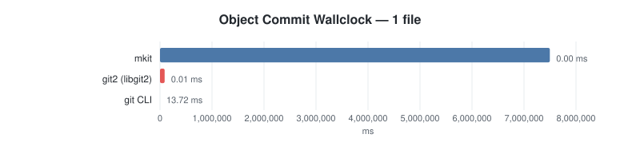
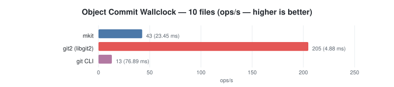
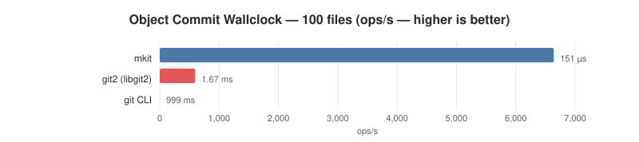
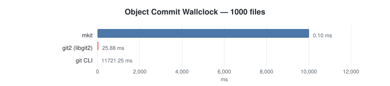

### Pack creation

End-to-end "store N blobs, content-addressed" — mkit's BLAKE3 path vs
`git2 odb.write` vs `git pack-objects --stdout` on the same blob set.
Same chart convention: bar = ops/s (longer = better), label shows
ops/s and latency.

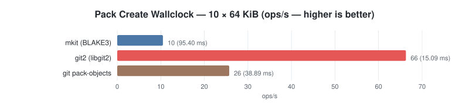
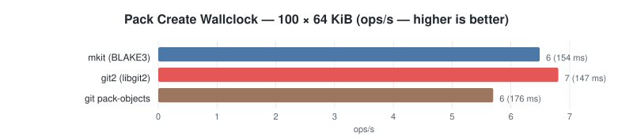
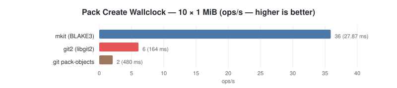
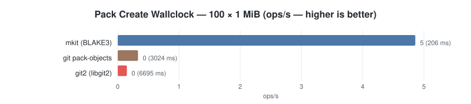

Numbers will vary by hardware, kernel, filesystem, and how warm the
cargo / link caches are. Re-run `cargo bench --workspace -- --quick`
plus `cargo run -p mkit-benches --bin render-charts` to refresh the
charts on your machine.

## Build

Requires **Rust 1.95** (pinned in `rust/rust-toolchain.toml`; rustup
will install it automatically on first build).

```sh
cd rust
cargo build --release                       # mkit binary → target/release/mkit
cargo test --workspace                      # all crates
cargo fmt --check                           # formatting gate (CI-enforced)
cargo clippy --all-targets -- -D warnings   # lint gate
```

Workspace crates:

| Crate | Purpose |
|---|---|
| `mkit-core` | hash, object, serialize, store, sign, chunker, delta, pack, refs, index, worktree, ignore, repo_lock, ops, protocol |
| `mkit-attest` | JCS, in-toto v1 Statement, DSSE envelope, signers, verify |
| `mkit-keystore` | platform-aware signing-key vault (software, OS keychains, HashiCorp Vault, external signers) — see [`docs/SPEC-KEYSTORE.md`](docs/SPEC-KEYSTORE.md) |
| `mkit-rpc` | shared wire schemas + length-prefixed framing for stdio subprocess protocols (external signers, future agents) |
| `mkit-transport-{memory,file,http,s3,ssh}` | Transport trait implementations |
| `mkit-cli` | the `mkit` binary |
| `mkit-wasm` | wasm-bindgen surface for browsers / Cloudflare Workers, published to npm as `@makechain/mkit-wasm` |
| `mkit-fuzz` | bounded property tests (cargo-fuzz compatible) |

`scripts/verify-rename.sh` is the rename-gate enforced in CI; it greps
the public build surface (`rust/`) for forbidden legacy strings that
should never appear in the generic `mkit` utility (see the script's
`FORBIDDEN` array for the full list).

## Architecture

mkit is a content-addressed VCS layered into a small `mkit-core`
crate (object model, hashing, refs, packfile, signing, transport
trait) plus one crate per transport and one binary crate
(`mkit-cli`) that wires them together. The same core is exposed to
the browser via `mkit-wasm` and to programmatic users via
`cargo add mkit-core`.

### Layers

```text
┌───────────────────────────────────────────────────────────────┐
│  mkit-cli                       — argv parser + dispatcher    │
│  (binary `mkit`, ships every subcommand documented in CLI.md) │
└───────────────────────────────────────────────────────────────┘
                              │
┌───────────────────────────────────────────────────────────────┐
│  mkit-core                     — content-addressed primitives │
│  ┌──────────────┬──────────────┬──────────────┬──────────────┐│
│  │ hash         │ object       │ pack         │ index        ││
│  │ (BLAKE3)     │ (Blob/Tree/  │ (delta+CDC,  │ (staging,    ││
│  │              │  Commit/     │  SPEC-PACK)  │  SPEC-INDEX) ││
│  │              │  Remix,      │              │              ││
│  │              │  SPEC-OBJ)   │              │              ││
│  ├──────────────┼──────────────┼──────────────┼──────────────┤│
│  │ refs         │ store        │ sign         │ ops          ││
│  │ (named tips, │ (on-disk     │ (Ed25519     │ (status,     ││
│  │  HEAD)       │  CAS)        │  + verify)   │  merge,      ││
│  │              │              │              │  bisect, …)  ││
│  ├──────────────┴──────────────┴──────────────┴──────────────┤│
│  │           protocol::Transport (object-graph trait)         │
│  └────────────────────────────────────────────────────────────┘
└───────────────────────────────────────────────────────────────┘
                              │
   ┌──────────┬──────────┬────┴─────┬──────────┬──────────┐
   ▼          ▼          ▼          ▼          ▼          ▼
┌──────┐  ┌──────┐  ┌─────────┐  ┌──────┐  ┌──────┐  ┌──────┐
│memory│  │ file │  │  http   │  │  s3  │  │ ssh  │  │ wasm │
│      │  │      │  │ (gateway│  │ (R2, │  │(forced│  │(browser
│tests │  │local │  │  worker)│  │ etc.)│  │ cmd) │  │ +CFW)│
└──────┘  └──────┘  └─────────┘  └──────┘  └──────┘  └──────┘
   one crate per transport, plus mkit-wasm for the JS surface
```

Each transport implements the same trait — `list_refs`, `read_ref`,
`write_ref`, `pack_exists`, `download_pack`, `upload_pack` —
described in [`docs/SPEC-TRANSPORT.md`](docs/SPEC-TRANSPORT.md). The
URL scheme picks the transport: `mkit+ssh://`, `mkit+s3://`,
`mkit+https://`, `mkit+file://`. There is no built-in "smart"
fallback — the scheme is part of the contract.

### Content addressing

Every object is identified by the BLAKE3 hash of its canonical
serialization. There is no hashing-algorithm negotiation, no
SHA-1/SHA-256 dichotomy. Hashes are stable across all transports
and storage backends, including the WASM build. The hashing
section above quantifies why this choice was free at the
performance layer.

Object kinds (full schema in
[`docs/SPEC-OBJECTS.md`](docs/SPEC-OBJECTS.md)):

| Kind          | Purpose                                                |
|---------------|--------------------------------------------------------|
| Blob          | File contents (or chunked via FastCDC for large files) |
| Tree          | Directory snapshot                                     |
| Commit        | Tree + parents + Ed25519 signature + author Identity   |
| Remix         | Signed derivative of one or more commits (attestation-friendly) |
| ChunkedBlob   | Index of FastCDC chunks for blob > chunk threshold     |
| Delta         | Bsdiff-like delta between two blobs (pack-internal)    |

### Attestation model

mkit ships **native attestation as a first-class object type**, not
as a side-channel. A signed in-toto v1 Statement wrapped in a DSSE
envelope (RFC pending; spec at
[`docs/SPEC-ATTESTATIONS.md`](docs/SPEC-ATTESTATIONS.md)) is stored
under `.mkit/attestations/<commit-hash>/<att-id>.dsse` and can be
produced by any signer that speaks the
[v1 stdio protocol](docs/SPEC-EXTERNAL-SIGNER.md):

```text
                       ┌──────────────────────────────┐
                       │       mkit attest            │
                       │   (in-toto v1 + DSSE)        │
                       └──────────┬───────────────────┘
                                  │
        ┌─────────────────────────┼─────────────────────────────┐
        ▼                         ▼                             ▼
┌─────────────────┐    ┌──────────────────────┐    ┌────────────────────┐
│ repo-key signer │    │ external signer      │    │ keyless / sigstore │
│  (Ed25519 from  │    │ (subprocess, stdio   │    │ (planned, OIDC →   │
│   .mkit/keys)   │    │   protocol; runs     │    │   short-lived cert)│
│                 │    │   TPM, FIDO2/CTAP,   │    │                    │
│ commit & remix  │    │   secure enclave,    │    │                    │
│ also use this   │    │   …)                 │    │                    │
└─────────────────┘    └──────────────────────┘    └────────────────────┘
```

Attestations carry the commit hash as the in-toto `subject`, so
they verify with off-the-shelf tooling (cosign, in-toto-go, custom
verifiers). Anything that produces a valid DSSE envelope with an
in-toto v1 Statement can attest to a mkit commit; conversely,
mkit's attestations are consumable by any standards-compliant
verifier. Multi-signer envelopes (one envelope, N signatures) work
out of the box — see
[`docs/SPEC-ATTESTATIONS.md`](docs/SPEC-ATTESTATIONS.md) §6.

### CLI ergonomics

Every subcommand parses arguments through `clap-derive` (see
`mkit-cli/src/clap_shim.rs`) and follows POSIX conventions
documented in [`docs/CLI.md`](docs/CLI.md):

- **stdout = data, stderr = diagnostics.** `mkit status > /tmp/out`
  produces an empty file in a clean tree; banners and progress go
  to stderr.
- **`--porcelain` / `--format=json`** modes on every read-style
  command (`status`, `log`, `branch`, `blame`, `remote`, `config`)
  for scripting.
- **Exit codes follow BSD `sysexits(3)`.** Shell scripts can
  distinguish user typos (64) from transient transport failures
  (75) without parsing stderr.
- **Signals:** SIGINT/SIGTERM set a graceful-shutdown flag polled
  by long-running operations (push/pull/clone/log). SIGPIPE is
  ignored (Rust runtime default); pipelines like
  `mkit log | head -1` exit cleanly.

## Identity & push auth — one key, many roles

`.mkit/keys/default.key` is a raw Ed25519 seed. The same seed covers:

- commit / remix signing (`docs/SPEC-SIGNING.md`);
- DSSE attestation signing via the `repo-key` signer (`docs/SPEC-ATTESTATIONS.md` §6.2);
- SSH transport authentication — OpenSSH 8.0+ accepts a raw Ed25519
  seed as `id_ed25519`, so the same key authenticates your
  `mkit push` over `mkit+ssh://`.

For `mkit+ssh://` push authorisation the idiomatic pattern is Git's:
the server's `sshd` runs an `AuthorizedKeysCommand` that maps an
incoming pubkey to an account, and `mkit serve` executes as that
account. mkit core ships **no custom push-auth protocol** — SSH's own
KEX handshake already does the nonce/signature exchange, and
`AuthorizedKeysCommand` is the standard server-side extension point
for resolving `pubkey → account`. A downstream service can wire its
own identity model (e.g. pubkey → on-chain owner address) through
that hook without changing the wire protocol.

See `docs/SPEC-SIGNING.md` §8 for the convention and
`docs/SSH-SECURITY.md` for transport trust model.

## Documentation

The SPEC documents below are stamped `status: draft` pending review
polish, but the v1 wire and on-disk formats they describe are pinned
by the test vectors under [`rust/tests/golden/`](rust/tests/golden/)
and will remain stable through the 0.x series — see
[Status](#status).

| Doc | Audience |
|---|---|
| [`docs/INSTALL.md`](docs/INSTALL.md) | End users — install channels, verification, hardware signers |
| [`docs/CLI.md`](docs/CLI.md) | End users — subcommands, env vars, exit codes |
| [`docs/keystore.md`](docs/keystore.md) | End users — keystore overview, picking a backend |
| [`docs/SPEC-INDEX.md`](docs/SPEC-INDEX.md) | Implementers — staging-index format |
| [`docs/SPEC-RPC.md`](docs/SPEC-RPC.md) | Implementers — shared stdio framing for subprocess protocols |
| [`docs/SPEC-KEYSTORE.md`](docs/SPEC-KEYSTORE.md) | Implementers — keystore vault interface, backend requirements |
| [`docs/SPEC-EXTERNAL-SIGNER.md`](docs/SPEC-EXTERNAL-SIGNER.md) | Integrators — external signer stdio protocol |
| [`docs/SPEC-ATTESTATIONS.md`](docs/SPEC-ATTESTATIONS.md) | Implementers + integrators — native attestation primitive (in-toto v1 + DSSE) |
| [`docs/SPEC-OBJECTS.md`](docs/SPEC-OBJECTS.md) | Implementers of compatible tools — on-disk format |
| [`docs/SPEC-SIGNING.md`](docs/SPEC-SIGNING.md) | Implementers — commit signing format |
| [`docs/SPEC-PACKFILE.md`](docs/SPEC-PACKFILE.md) | Implementers — packfile wire format |
| [`docs/SPEC-DELTA.md`](docs/SPEC-DELTA.md) | Implementers — delta encoding |
| [`docs/SPEC-REFS.md`](docs/SPEC-REFS.md) | Implementers — ref names and CAS |
| [`docs/SPEC-TRANSPORT.md`](docs/SPEC-TRANSPORT.md) | Implementers — 7-verb transport protocol incl. SSH OP_HELLO |
| [`docs/SPEC-FASTCDC.md`](docs/SPEC-FASTCDC.md) | Implementers — content chunking |
| [`docs/ARCHITECTURE.md`](docs/ARCHITECTURE.md) | Contributors — module layering and design notes |
| [`docs/THREAT-MODEL.md`](docs/THREAT-MODEL.md) | Operators + reviewers — trust boundaries and security assumptions |
| [`docs/STYLE-GUIDE.md`](docs/STYLE-GUIDE.md) | Contributors — writing style for docs and commit messages |
| [`docs/SSH-SECURITY.md`](docs/SSH-SECURITY.md) | Operators — SSH transport trust model |
| [`docs/RELEASE.md`](docs/RELEASE.md) | Maintainers — release procedure overview |
| [`docs/release/`](docs/release/) | Maintainers — release checklist, signing, reproducibility, supply chain |
| [`docs/FUZZ.md`](docs/FUZZ.md) | Contributors — fuzz harness conventions |

## Installing

Four channels. Pick one. Long-form guide with verification steps in
[`docs/INSTALL.md`](docs/INSTALL.md).

### From source (works today)

```sh
cargo install --git https://github.com/officialunofficial/mkit mkit-cli
```

Requires Rust 1.95 (rustup picks it up from `rust/rust-toolchain.toml`
on first build). Drops `mkit` into `~/.cargo/bin/`.

### From GitHub Releases (works today)

Cosign-signed archives for macOS (arm64 + x86_64) and Linux (x86_64 +
arm64) on every `v*.*.*` tag:

```sh
VERSION=0.1.0
TARGET=aarch64-apple-darwin
curl -LO "https://github.com/officialunofficial/mkit/releases/download/v${VERSION}/mkit-${VERSION}-${TARGET}.tar.gz"
tar -xzf "mkit-${VERSION}-${TARGET}.tar.gz"
```

The one-liner `curl -sSfL …/install.sh | sh` picks the right archive
and verifies the cosign bundle by default. Pass `--version vX.Y.Z` to
pin an exact release.

### WASM for browsers and Cloudflare Workers

```sh
bun add @makechain/mkit-wasm     # or: npm i @makechain/mkit-wasm
```

TypeScript + Workers examples in
[`docs/INSTALL.md`](docs/INSTALL.md#wasm--npm).

### Hardware signers (optional)

External signers are separate binaries that mkit drives over the
[v1 stdio protocol](docs/SPEC-EXTERNAL-SIGNER.md):

```sh
# File-backed reference signer (any platform)
cargo install --git https://github.com/officialunofficial/mkit --bin mkit-sign-file

# TPM 2.0 (Linux/Windows; install libtss2-dev first on Debian/Ubuntu)
cargo install --git https://github.com/officialunofficial/mkit --bin mkit-sign-tpm --features tpm2

# Apple Secure Enclave (macOS, Swift)
cd contrib/signers/mkit-sign-se && swift build -c release \
  && cp .build/release/mkit-sign-se /usr/local/bin/

# FIDO2 / WebAuthn (CTAP-HID)
cargo install --git https://github.com/officialunofficial/mkit --bin mkit-sign-ctap
```

Each signer ships its own README under
[`contrib/signers/`](contrib/signers/) with setup notes.

## Getting started

```sh
mkit init
mkit keygen
mkit add file.txt
mkit commit -m "first commit"
mkit log
```

Multi-algo attestation flow — sign with two algorithms at once and
verify against trust roots:

```sh
mkit keygen --algorithm p256 --print-pubkey
mkit attest --algorithm ed25519 \
            --additional-signer "algorithm=p256,signer=repo-key" \
            --predicate-type https://example.com/sign-off/v1
mkit verify-attest --trust-roots .mkit/attest-trust-roots.toml
```

See [`docs/CLI.md`](docs/CLI.md) for every subcommand and
[`docs/SPEC-ATTESTATIONS.md`](docs/SPEC-ATTESTATIONS.md) for the
attestation contract.

## Status

0.1.0 is the initial public release. See [`CHANGELOG.md`](CHANGELOG.md)
for the full change list.

## Contributing

This is a young project. Open issues and PRs welcome.

Security-sensitive disclosures: see [`SECURITY.md`](SECURITY.md).

## License

Dual-licensed under either of:

- MIT License ([LICENSE-MIT](LICENSE-MIT))
- Apache License, Version 2.0 ([LICENSE-APACHE](LICENSE-APACHE))

at your option. Unless you explicitly state otherwise, any contribution
intentionally submitted for inclusion in this project shall be dual-licensed
as above, without any additional terms or conditions.
