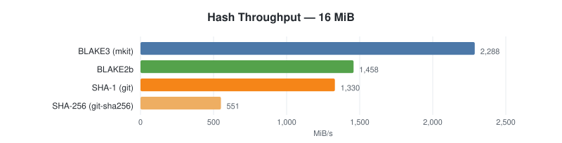

# mkit


[](#license)
[](https://crates.io/crates/mkit-cli)
[](https://docs.rs/mkit-core)
[](https://codecov.io/gh/officialunofficial/mkit)

A content-addressed version control toolkit written in Rust.

`mkit` is a generic content-addressed VCS — Git-like commits, refs,
transports — plus a native, predicate-agnostic attestation subsystem
(in-toto v1 Statements wrapped in DSSE envelopes) that any downstream
service can attach witness signatures to commits with. The v1 on-disk
and wire formats are pinned by golden vectors under
[`rust/tests/golden/`](rust/tests/golden/).

## Status

**Alpha (pre-1.0).** The v1 wire and on-disk formats are stable
through the 0.x line; APIs, CLI flags, and unpinned internals may
change in any 0.x release. See [`CHANGELOG.md`](CHANGELOG.md) for the
breaking-change record.

**MSRV** is Rust 1.95.0, pinned in
[`rust/rust-toolchain.toml`](rust/rust-toolchain.toml). MSRV bumps
are documented in the CHANGELOG; we follow a "current stable minus
one" policy unless a feature requires otherwise.

## Quick start

```sh
# install the CLI from crates.io (see "Installing" below for other channels)
cargo install mkit-cli

# make your first signed commit
mkit init           # create .mkit/ in the current dir
mkit keygen         # generate an Ed25519 signing key
echo hello > hi.txt
mkit add hi.txt
mkit commit -m "first commit"

# push to a remote (strict scheme — mkit+{file,https,s3,ssh,enc}://)
mkit remote add origin mkit+file:///srv/mkit/my-repo
mkit push origin            # first push records `origin` as the branch upstream
mkit push                   # subsequent pushes go to the recorded upstream
```

`mkit push` (no args) pushes the current branch to its upstream only,
rejecting a non-fast-forward update unless you pass `--force-with-lease`
or `--force`. Use `mkit push --all` to mirror every local branch (also
CAS-safe). `mkit remote add <url>` (no name) still configures the flat
default remote for back-compat.

Full CLI reference: [`docs/CLI.md`](docs/CLI.md).

## Installing

Pick one. Long-form guide with verification steps in
[`docs/INSTALL.md`](docs/INSTALL.md).

### Quick install (signed release binary)

```sh
curl mkit.sh | sh
```

Detects your OS + architecture, downloads the matching signed release
archive, verifies its cosign signature by default, and installs `mkit`
into `~/.local/bin`. Equivalent explicit form:
`curl -sSfL https://mkit.sh/install.sh | sh`. Pass `--version vX.Y.Z` to
pin an exact release (`curl -sSfL https://mkit.sh/install.sh | sh -s -- --version v0.3.0`).

### From source

```sh
cargo install --git https://github.com/officialunofficial/mkit mkit-cli
```

Requires Rust 1.95 (rustup picks it up from `rust/rust-toolchain.toml`
on first build). Drops `mkit` into `~/.cargo/bin/`.

> [!WARNING]
> Do **not** run `cargo install mkit` — the `mkit` name on crates.io
> belongs to an unrelated project. The CLI is published as **`mkit-cli`**
> (`cargo install mkit-cli`), and is also available via the release
> archives / `install.sh` above or `--git` from this repository.

### From GitHub Releases

Cosign-signed archives for macOS (arm64 + x86_64) and Linux (x86_64 +
arm64) on every `v*.*.*` tag:

```sh
VERSION=0.3.0
TARGET=aarch64-apple-darwin
curl -LO "https://github.com/officialunofficial/mkit/releases/download/v${VERSION}/mkit-${VERSION}-${TARGET}.tar.gz"
tar -xzf "mkit-${VERSION}-${TARGET}.tar.gz"
```

The one-liner `curl mkit.sh | sh` (or `curl -sSfL https://mkit.sh/install.sh | sh`)
picks the right archive and verifies the cosign bundle by default. Pass
`--version vX.Y.Z` to pin an exact release.

### WASM (npm)

```sh
bun add @makechain/mkit-wasm     # or: npm i @makechain/mkit-wasm
```

The `@makechain` scope is intentional — Makechain is an internal team
within Official Unofficial, Inc., not a separate entity. TypeScript and
Cloudflare Workers examples in
[`docs/INSTALL.md`](docs/INSTALL.md#wasm--npm).

### Hardware signers (optional)

External signers are separate binaries that mkit drives over the
[v1 stdio protocol](docs/specs/SPEC-EXTERNAL-SIGNER.md). The signer crates
live under [`contrib/signers/`](contrib/signers/) outside the
top-level Cargo workspace at `rust/`, so the install path is
`git clone` + `cargo install --path .`:

```sh
git clone https://github.com/officialunofficial/mkit
cd mkit/contrib/signers
cargo install --path mkit-sign-file                  # any platform
cargo install --path mkit-sign-tpm --features tpm2   # Linux/Windows TPM 2.0
cargo install --path mkit-sign-ctap                  # FIDO2 / CTAP-HID
# Apple Secure Enclave (macOS, Swift):
cd mkit-sign-se && swift build -c release \
  && cp .build/release/mkit-sign-se /usr/local/bin/
```

Each signer ships its own README under
[`contrib/signers/`](contrib/signers/).

## Keystore

Signing keys live in a pluggable keystore vault. Out of the box mkit
recognises:

- **software** / **software-raw** — encrypted-at-rest software vault
  on disk; the cross-platform foundation backend.
- **macos-keychain**, **windows-credential**, **linux-secret-service**
  — native OS keychains where available.
- **systemd-creds** — systemd's encrypted credential store on Linux
  hosts that have it.
- **yubikey** — hardware-backed via PIV / OpenPGP applets.
- **external signers** — separate subprocess binaries speaking the
  [v1 stdio protocol](docs/specs/SPEC-EXTERNAL-SIGNER.md); reference
  signers under [`contrib/signers/`](contrib/signers/).

The keystore vault abstracts these behind one interface so commit
signing, attestation signing, and SSH push-auth share key references.
The normative interface is in
[`docs/specs/SPEC-KEYSTORE.md`](docs/specs/SPEC-KEYSTORE.md); end-user overview
in [`docs/keystore.md`](docs/keystore.md). The backends a given
binary supports depend on enabled build features — see CLI.md
§"Config keys".

## Architecture

mkit is layered into `mkit-core` (object model, hashing, refs,
packfile, signing, transport trait), one crate per transport, and
the `mkit-cli` binary. The same core is exposed to the browser via
`mkit-wasm` and to programmatic users via `cargo add mkit-core`.

```text
┌──────────────────────────────────────────────────────────────┐
│  mkit-cli                     — argv parser + dispatcher     │
└──────────────────────────────────────────────────────────────┘
                              │
┌──────────────────────────────────────────────────────────────┐
│  mkit-core                    — content-addressed primitives │
│   hash · object · pack · index · refs · store · sign · ops   │
│                  protocol::Transport (trait)                 │
└──────────────────────────────────────────────────────────────┘
                              │
   ┌──────────┬──────────┬────┴─────┬──────────┬──────────┐
   ▼          ▼          ▼          ▼          ▼          ▼
┌──────┐  ┌──────┐  ┌─────────┐  ┌──────┐  ┌──────┐  ┌────────┐
│memory│  │ file │  │  http   │  │  s3  │  │ ssh  │  │  wasm  │
│tests │  │local │  │ gateway │  │ R2,… │  │forced│  │ browser│
│      │  │      │  │ worker  │  │      │  │ cmd  │  │  + CFW │
└──────┘  └──────┘  └─────────┘  └──────┘  └──────┘  └────────┘
```

Workspace crates:

| Crate | Purpose |
|---|---|
| `mkit-core` | hash, object, serialize, store, sign, chunker, delta, pack, refs, index, worktree, ignore, repo_lock, ops, protocol |
| `mkit-attest` | JCS, in-toto v1 Statement, DSSE envelope, signers, verify |
| `mkit-git-bridge` | deterministic mkit↔git bridge: export mirroring, importer-signed import, fork-mode publishing ([`docs/specs/SPEC-GIT-BRIDGE.md`](docs/specs/SPEC-GIT-BRIDGE.md), [`docs/specs/SPEC-GIT-IMPORT.md`](docs/specs/SPEC-GIT-IMPORT.md), [`docs/GUIDE-GIT-WORKFLOWS.md`](docs/GUIDE-GIT-WORKFLOWS.md)) |
| `mkit-keystore` | platform-aware signing-key vault (software, OS keychains, systemd-creds, YubiKey, external signers) — see [`docs/specs/SPEC-KEYSTORE.md`](docs/specs/SPEC-KEYSTORE.md) |
| `mkit-rpc` | shared wire schemas + length-prefixed framing for stdio subprocess protocols (external signers) |
| `mkit-transport-{memory,file,http,s3,ssh,enc}` | Transport trait implementations (`enc` = the `mkit+enc://` no-OpenSSH encrypted transport) |
| `mkit-cli` | the `mkit` binary |
| `mkit-wasm` | wasm-bindgen surface for browsers / Cloudflare Workers, published to npm as `@makechain/mkit-wasm` |
| `mkit-fuzz` (at `rust/fuzz/`, not `rust/crates/`) | bounded property tests (cargo-fuzz compatible) |

Each transport implements the same trait — `list_refs`, `read_ref`,
`write_ref`, `pack_exists`, `download_pack`, `upload_pack` — described
in [`docs/specs/SPEC-TRANSPORT.md`](docs/specs/SPEC-TRANSPORT.md). The URL scheme
picks the transport: `mkit+ssh://`, `mkit+enc://`, `mkit+s3://`,
`mkit+https://`, `mkit+file://`. There is no "smart" fallback — the scheme is part of
the contract. Deeper layering notes in
[`docs/ARCHITECTURE.md`](docs/ARCHITECTURE.md).

### Content addressing

Every object is identified by the BLAKE3 hash of its canonical
serialization. No hashing-algorithm negotiation, no SHA-1 / SHA-256
dichotomy. Hashes are stable across all transports and storage
backends, including WASM.

Object kinds (full schema in
[`docs/specs/SPEC-OBJECTS.md`](docs/specs/SPEC-OBJECTS.md)):

| Kind         | Purpose                                                    |
|--------------|------------------------------------------------------------|
| Blob         | File contents (or chunked via FastCDC for large files)     |
| Tree         | Directory snapshot                                         |
| Commit       | Tree + parents + Ed25519 signature + author Identity       |
| Remix        | Signed derivative of one or more commits                   |
| ChunkedBlob  | Index of FastCDC chunks for blob > chunk threshold         |
| Delta        | Bsdiff-like delta between two blobs (pack-internal)        |

## Attestations

mkit ships **native attestation as a first-class object type**, not a
side-channel. A signed in-toto v1 Statement wrapped in a DSSE envelope
(spec at [`docs/specs/SPEC-ATTESTATIONS.md`](docs/specs/SPEC-ATTESTATIONS.md)) is
stored under `.mkit/attestations/<commit-hash>/<att-id>.dsse` and can
be produced by any signer that speaks the
[v1 stdio protocol](docs/specs/SPEC-EXTERNAL-SIGNER.md):

```text
                       ┌──────────────────────────────┐
                       │       mkit attest            │
                       │   (in-toto v1 + DSSE)        │
                       └──────────┬───────────────────┘
                                  │
        ┌─────────────────────────┼─────────────────────────────┐
        ▼                         ▼                             ▼
┌─────────────────┐    ┌──────────────────────┐    ┌────────────────────┐
│ repo-key signer │    │ external signer      │    │ keyless / sigstore │
│  (Ed25519 from  │    │ (subprocess, stdio   │    │ (planned, OIDC →   │
│   .mkit/keys)   │    │   protocol; TPM,     │    │   short-lived cert)│
│                 │    │   FIDO2/CTAP, SE,…)  │    │                    │
└─────────────────┘    └──────────────────────┘    └────────────────────┘
```

Attestations carry the commit hash as the in-toto `subject`, so they
verify with off-the-shelf tooling (cosign, in-toto-go, custom
verifiers). Anything that produces a valid DSSE envelope with an
in-toto v1 Statement can attest to an mkit commit; conversely, mkit's
attestations are consumable by any standards-compliant verifier.
Multi-signer envelopes (one envelope, N signatures) work out of the
box — see [`docs/specs/SPEC-ATTESTATIONS.md`](docs/specs/SPEC-ATTESTATIONS.md) §6.

Multi-algo attestation flow:

```sh
mkit keygen --algorithm p256 --print-pubkey
mkit attest --algorithm ed25519 \
            --additional-signer "algorithm=p256,signer=repo-key" \
            --predicate-type https://example.com/sign-off/v1
mkit verify-attest --trust-roots .mkit/attest-trust-roots.toml
```

## Identity & push auth

`.mkit/keys/default.key` is a raw Ed25519 seed. The same seed covers:

- commit / remix signing ([`docs/specs/SPEC-SIGNING.md`](docs/specs/SPEC-SIGNING.md));
- DSSE attestation signing via the `repo-key` signer
  ([`docs/specs/SPEC-ATTESTATIONS.md`](docs/specs/SPEC-ATTESTATIONS.md) §6.2);
- SSH transport authentication — OpenSSH 8.0+ accepts a raw Ed25519
  seed as `id_ed25519`, so the same key authenticates `mkit push`
  over `mkit+ssh://`.

For `mkit+ssh://` push authorisation the idiomatic pattern is Git's:
server `sshd` runs an `AuthorizedKeysCommand` that maps an incoming
pubkey to an account, and `mkit serve` executes as that account. mkit
core ships **no custom push-auth protocol** — SSH's KEX already does
the nonce/signature exchange, and `AuthorizedKeysCommand` is the
standard server-side hook for `pubkey → account`. A downstream
service can wire its own identity model (e.g. pubkey → on-chain
owner address) through that hook without changing the wire protocol.
See [`docs/SSH-SECURITY.md`](docs/SSH-SECURITY.md) for the transport
trust model.

## CLI ergonomics

Every subcommand parses arguments through `clap-derive` and follows
POSIX conventions documented in [`docs/CLI.md`](docs/CLI.md):

- **stdout = data, stderr = diagnostics.** `mkit status > /tmp/out`
  produces an empty file in a clean tree; banners and progress go to
  stderr.
- **`--porcelain` / `--format=json`** modes on every read-style
  command (`status`, `log`, `branch`, `blame`, `remote`, `config`).
- **Exit codes follow BSD `sysexits(3)`.** Shell scripts can
  distinguish user typos (64) from transient transport failures (75)
  without parsing stderr.
- **Signals:** SIGINT/SIGTERM set a graceful-shutdown flag polled by
  long-running operations. SIGPIPE is ignored; pipelines like
  `mkit log | head -1` exit cleanly.

## Performance

mkit uses **BLAKE3** as its content-address primitive (Git uses SHA-1
or SHA-256). On an Apple Silicon laptop, single-core in-process:



Full benchmark set — hashing across input sizes, signature throughput
by algorithm, object commit vs `git2` / `git CLI`, pack creation —
lives in [`benchmarks/charts/`](benchmarks/charts/). Numbers vary by
hardware, kernel, filesystem, and cache warmth; reproduce locally
with `cargo bench --workspace -- --quick` plus
`cargo run -p mkit-benches --bin render-charts`.

## Documentation

Each SPEC carries its own `status:` header — `draft`, `stable`,
`transport-delivery-shipped`, `implemented`, or `normative` — reflecting how settled
that document is. Regardless of header, the v1 wire and on-disk formats
they describe are pinned by the test vectors under
[`rust/tests/golden/`](rust/tests/golden/) and remain stable through the
0.x series.

| Doc | Audience |
|---|---|
| [`docs/INSTALL.md`](docs/INSTALL.md) | End users — install channels, verification, hardware signers |
| [`docs/CLI.md`](docs/CLI.md) | End users — subcommands, env vars, exit codes |
| [`docs/keystore.md`](docs/keystore.md) | End users — keystore overview, picking a backend |
| [`docs/GUIDE-GIT-WORKFLOWS.md`](docs/GUIDE-GIT-WORKFLOWS.md) | End users — migrate from git, track a git upstream, push work back |
| [`docs/ARCHITECTURE.md`](docs/ARCHITECTURE.md) | Contributors — module layering and design notes |
| [`docs/PARITY.md`](docs/PARITY.md) | Contributors — v1 scope gate, machine-output contract, and tracked divergences (the per-command matrix is the web `/parity` page) |
| [`docs/PROFILING.md`](docs/PROFILING.md) | Contributors — benchmarking and profiling workflow |
| [`docs/specs/SPEC-INDEX.md`](docs/specs/SPEC-INDEX.md) | Implementers — staging-index format |
| [`docs/specs/SPEC-OBJECTS.md`](docs/specs/SPEC-OBJECTS.md) | Implementers — object on-disk format |
| [`docs/specs/SPEC-MERKLE-OBJECTS.md`](docs/specs/SPEC-MERKLE-OBJECTS.md) | Implementers — BMT-root identity for `Tree`/`ChunkedBlob` |
| [`docs/specs/SPEC-GC.md`](docs/specs/SPEC-GC.md) | Implementers — garbage-collection retention roots & recovery |
| [`docs/specs/SPEC-PACKFILE.md`](docs/specs/SPEC-PACKFILE.md) | Implementers — packfile wire format |
| [`docs/specs/SPEC-DELTA.md`](docs/specs/SPEC-DELTA.md) | Implementers — delta encoding |
| [`docs/specs/SPEC-PACK-SHARDS.md`](docs/specs/SPEC-PACK-SHARDS.md) | Implementers — erasure-coded pack delivery |
| [`docs/specs/SPEC-REFS.md`](docs/specs/SPEC-REFS.md) | Implementers — ref names and CAS |
| [`docs/specs/SPEC-TRANSPORT.md`](docs/specs/SPEC-TRANSPORT.md) | Implementers — 7-verb transport protocol incl. SSH OP_HELLO |
| [`docs/specs/SPEC-TRANSPORT-ENC.md`](docs/specs/SPEC-TRANSPORT-ENC.md) | Implementers — `mkit+enc://` no-OpenSSH encrypted transport |
| [`docs/specs/SPEC-SPARSE-CHECKOUT.md`](docs/specs/SPEC-SPARSE-CHECKOUT.md) | Implementers — verifiable server-side sparse delivery |
| [`docs/specs/SPEC-FASTCDC.md`](docs/specs/SPEC-FASTCDC.md) | Implementers — content chunking |
| [`docs/specs/SPEC-SIGNING.md`](docs/specs/SPEC-SIGNING.md) | Implementers — commit signing format |
| [`docs/specs/SPEC-KEYSTORE.md`](docs/specs/SPEC-KEYSTORE.md) | Implementers — keystore vault interface |
| [`docs/specs/SPEC-RPC.md`](docs/specs/SPEC-RPC.md) | Implementers — shared stdio framing for subprocess protocols |
| [`docs/specs/SPEC-EXTERNAL-SIGNER.md`](docs/specs/SPEC-EXTERNAL-SIGNER.md) | Integrators — external signer stdio protocol |
| [`docs/specs/SPEC-ATTESTATIONS.md`](docs/specs/SPEC-ATTESTATIONS.md) | Implementers + integrators — native attestation (in-toto v1 + DSSE) |
| [`docs/specs/SPEC-HISTORY-PROOF.md`](docs/specs/SPEC-HISTORY-PROOF.md) | Implementers — MMR commit-chain inclusion proofs (light-client attestation) |
| [`docs/specs/SPEC-GIT-IMPORT.md`](docs/specs/SPEC-GIT-IMPORT.md) | Implementers — importer-signed git→mkit translation |
| [`docs/specs/SPEC-GIT-BRIDGE.md`](docs/specs/SPEC-GIT-BRIDGE.md) | Implementers — deterministic mkit→git translation |
| [`docs/specs/SPEC-RELEASE-THRESHOLD.md`](docs/specs/SPEC-RELEASE-THRESHOLD.md) | Implementers — BLS12-381 threshold signatures for releases |
| [`docs/SSH-SECURITY.md`](docs/SSH-SECURITY.md) | Operators — SSH transport trust model |
| [`docs/specs/SPEC-CONFIG-SECURITY.md`](docs/specs/SPEC-CONFIG-SECURITY.md) | Operators + implementers — repo-vs-user config trust split |
| [`docs/THREAT-MODEL.md`](docs/THREAT-MODEL.md) | Operators + reviewers — trust boundaries and security assumptions |
| [`docs/RELEASE.md`](docs/RELEASE.md) | Maintainers — release runbook: checklist, signing, reproducibility, supply chain, crates.io |
| [`docs/FUZZ.md`](docs/FUZZ.md) | Contributors — fuzz harness conventions |
| [`docs/STYLE-GUIDE.md`](docs/STYLE-GUIDE.md) | Contributors — writing style for docs and commits |

## Build

```sh
cd rust
cargo build --release                       # mkit binary → target/release/mkit
cargo test --workspace                      # all crates
cargo fmt --check                           # formatting gate (CI-enforced)
cargo clippy --all-targets -- -D warnings   # lint gate
```

## Contributing

Issues and PRs welcome. See [`CONTRIBUTING.md`](CONTRIBUTING.md) for
build/test/style expectations and the inbound-license policy
(inbound = outbound, no DCO/CLA). Security-sensitive disclosures: see
[`SECURITY.md`](SECURITY.md).

## License

Dual-licensed under either of:

- MIT License ([`LICENSE-MIT`](LICENSE-MIT))
- Apache License, Version 2.0 ([`LICENSE-APACHE`](LICENSE-APACHE))

at your option. Unless you explicitly state otherwise, any
contribution intentionally submitted for inclusion in this project
shall be dual-licensed as above, without any additional terms or
conditions.

mkit is published by Official Unofficial, Inc.; the mkit name and
marks are owned by the company.
