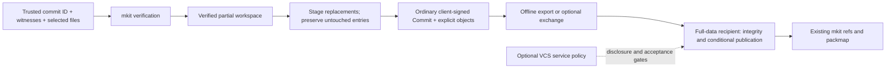

# Scoped workspaces: mkit-native authenticated partial editing

Revised planning draft, 2026-09-16; code baseline `9f7511d0`. Supersedes the former 25-PR, server-first plan. The owner approved the architectural separation and requested consolidation; execution is **not** authorized. [Design](01-design.md), [PR map](02-phases.md), [questions](03-open-questions.md), [consumer notes](04-makechain-notes.md).

## Problem and product promise

A client with a trusted mkit commit ID, sufficient authenticated Tree witnesses and complete selected files can stage replacements and create an ordinary signed mkit Commit without the undisclosed repository content. It can hand that commit and its explicit new objects to a recipient holding the retained base.

This is an mkit capability, not a permission issued by a hosting product. No owner registration, grant, service, expiry check or makechain dependency is required to verify, edit, stage, sign or export locally. Proofs establish content integrity, not authority. Updating someone else's remote ref remains subject to the recipient's policy and storage capabilities.

mkit's BLAKE3 IDs, canonical objects, BMT witnesses, Commit/Remix signing, closure profiles, raw packs and ref/packmap contracts are the foundation. Git/GitHub is only a layering analogy; no Git object model, promisor semantics or security assumptions are imported.

## Goals and non-goals

- Preserve default full clones, object formats, signatures and transport behavior.
- Opt-in verified-base overlay, complete selected files and explicit coverage.
- Existing regular/executable file content replacement, modes preserved; untouched files, symlinks, subtrees and empty Trees remain identical.
- Offline staging and ordinary client-signed Commit creation; no Change object, server signature or grant field in Commit.
- Explicit object export/exchange; no closure-difference planning on an incomplete client.
- Native/wasm parity; workspace-worker exercises the portable engine early.
- Separate optional reference-host profile for confidential reads, restricted writes and durable publication.

“Add a change” means stage a replacement in this MVP, not create a new path. Add/delete/rename, mode changes, symlink edits, chunk-only edits, automatic rebase/merge and lazy fetch remain out of scope. Whole chunked files work within explicit limits; consumer limits remain narrower.

Core owns factual verification: bytes, IDs, signatures, typed edges, chunk consistency, changed entries and dependency inventories. Services own ownership, collaborators, grants, revocation, branch protection, publication permission, confidentiality and execution policy. The same valid commit can be accepted by one host and denied by another.

No mandatory SPEC-GRANTS, mkit_core::grants, chain adapter or host-issued workspace identity in core. Optional host codecs/wasm bindings live in hosting-support modules. Transport authentication, access-denied errors and conditional updates remain useful mechanisms.

COMPATIBILITY WATCH: ordinary full clones, packs, refs, signatures, missing-object failures and commands retain their defaults. New scoped markers cause refusal only in positively identified scoped roots. Managed hosting changes access only on its dedicated deployment. Mandatory signed reads, global ACL/closure admission, changed ordinary GC, or a new RefStore dependency on default pack reads are NOT approved; escalate any such change.

Tier 2 is shelved, not a phase. Require a concrete customer needing hidden sibling names. Digest skeletons cannot establish insertion/rename placement or absence. Replacement-only proof reconstruction and server-prepares/client-signs plus separate receipt remain research options.

## Architecture

No centralized server is required for commit construction or bundle exchange. A full-data recipient checks resulting complete closure when the client cannot. Reference hosting is an implementation, not a protocol trust root.

## Phases and user-facing outcomes

| Phase | PRs | User outcome / exit |
| --- | --- | --- |
| 1. Portable partial-edit engine | 01–03 (3) | Verify selected data, edit and sign offline. Native/wasm agree. workspace-worker imports/captures a public bundle without full source fetching; no confidentiality claim. |
| 2. Native workspace and handoff | 04–07 (4) | Create isolated workspaces, inspect/stage, commit/export and explicitly transfer objects. Offline full-recipient verification needs no grant. Publication guarantees are explicitly transport-specific. |
| 3. Optional secure hosting | 08–12 (5) | Reference VCS service privately delivers subsets and publishes restricted changes using its own policy. All legacy bypass routes gated. |
| 4. Private consumer and release assurance | 13–15 (3) | Private hosted round trip, adversarial/recovery coverage and full-clone compatibility audit. |

**15 PRs instead of 25**, grouped 3 / 4 / 5 / 3. Roughly 1,000–2,500 handwritten lines including tests/specs per coherent behavior; exceptional 3,000 for integrated publication. Re-slice before execution if larger; never remove tests to fit. First-phase PR01–03 plus PR04 have fresh briefs. Old server-first PR01–07 briefs are superseded and removed.

Hosting is optional for core use, mandatory for confidential hosted rollout. Core/offline exits do not wait for grants. No chain change gates any phase.

## Threat model

Core treats bundles, manifests, objects, local files and remote responses as untrusted: reject false proofs, malformed graphs, traversal, invalid signatures and partial-state confusion. Never claim verification of hidden bytes.

Private hosts additionally prevent hidden Blob/chunk/Tree grafting, ancestry injection, legacy-route bypass, revocation races, cross-ref replay, duplicate publication and resource exhaustion. Full-data host/policy store are trusted for confidentiality. Proofs cannot constrain a malicious holder of all content.

Selected code must not execute against hidden data or broad credentials. File scope is not an execution sandbox. Public copies cannot be recalled. Witnesses reveal sibling names/modes/hashes/counts; deterministic hashes permit correlation and confirmation of guesses. No encryption or zero-knowledge claim.

## Acceptance matrix

| ID | Scenario | Expected result | PRs |
| --- | --- | --- | --- |
| A01 | Ordinary clone/push/unsigned reads/GC | Existing defaults/fixtures unchanged | 04,08,14,15 |
| A02 | Offline subset without grant/service/owner | Verify, stage, sign, export succeeds | 01,02,05,07 |
| A03 | Same bundle/commit, two host policies | Same core validity; independent decisions | 06,09,14 |
| A04 | Revocation after disclosure | Proof/commit still valid; new private effects denied | 09,12,14 |
| A05 | Wrong base/witness/payload or missing chunk | Atomic rejection, no fallback | 01,03,10 |
| A06 | Siblings and converging paths; hidden/empty Trees | Untouched triples identical; ancestors rebuilt once | 02,14 |
| A07 | Wrong typed edge, sizes, contradictory reused-ID roles | Semantic failure despite valid hashes | 01,06,11 |
| A08 | Add/delete/rename/mode/symlink/subtree replacement | Unsupported profile operation; draft retained | 02,03,05,11 |
| A09 | Hidden Blob/chunk/Tree graft | Private host denies even with full closure | 11,14 |
| A10 | Supplied bytes equal hidden stored object | Bytes accepted; bare hidden ID insufficient | 11,14 |
| A11 | Extra parents/intermediate history | Partial-update v1 rejects; ordinary format unchanged | 02,06,11 |
| A12 | Concurrent sibling edits | First CAS wins; second conflicts; no rebase | 06,12,13 |
| A13 | Packmap-only race | Bounded reprepare; candidate unchanged | 12 |
| A14 | Restart/lost reply/newer head/expired envelope | Managed saved outcome; no second effect | 12,13 |
| A15 | Changed persisted request; reused ID on DurableResults host | Client preserves request identity; managed host returns OperationIdConflict | 07,12 |
| A16 | Crash across upload/validation/CAS/response | No dangling accepted head or lost pins | 12,14 |
| A17 | Oversized/million-entry directory/resource flood | Typed bounded failure, never full pack | 01,10,11 |
| A18 | Every legacy route × every principal role | Managed matrix includes existence/streaming/aliases | 08,14 |
| A19 | Missing config/policy outage/revoked resume | Managed fails closed; default artifact unchanged | 08,12 |
| A20 | Public workspace/fork/preview/history routes | Private mode denied before import | 13,14 |
| A21 | Stage A, edit B, restart | Stage A and pending candidate retained | 04,05,07 |
| A22 | Normal commands in scoped/nested root | Refuse, never discover parent or infer deletion | 04,05 |
| A23 | Full recipient unions base and update | Complete snapshot; ordinary history retained | 06,12,14 |
| A24 | Native/wasm vectors | Identical bytes/roots/errors, no zstd/blst | 01–03,14 |
| A25 | Filesystem case/normalization/link alias | Reject before exposure/capture | 03–05 |
| A26 | Offline export/unsupported remote | Export works; unsupported push never full-clones | 02,06,07 |
| A27 | Partial vs snapshot/history verification | Honest coverage; no false completeness | 01,06,07 |
| A28 | Allocation/count overflow/cached edge checks | Bounded validation for every edge role | 01,06,14 |

## Risks and dependencies

| Risk | Response / reviewer |
| --- | --- |
| Core acquires hosting policy | Dependency boundary and A02–A04; architecture |
| Proof language implies permission | Distinguish local creation, publication and authority; product |
| Partial proof mistaken for closure | Explicit reports and recipient typed checks; core |
| Transfer fallback/dedup leaks bytes | Exact response sets and host origin checks; security |
| Local transport falsely claims atomic/durable acceptance | Preserve documented append-only packmap semantics; transport |
| R2 lacks object index; validation too expensive | Raw enrollment/catalog, measured limits; storage |
| Service-held signing key misrepresented | Explicit custody statement; consumer |
| Larger PRs exceed review capacity | Cohesive scope, second reviewer, pre-execution re-slicing; integrator |

No makechain dependency. Notes in 04 are a consumer communication draft only: no chain features, taxonomy changes, code or messages.

## Branch strategy and done criteria

Planning stays on `plan/scoped-workspaces` in its isolated worktree. No implementation branch, issues, PRs, deployment or executor runs during planning. After explicit execution authorization the integrator creates `feat/scoped-workspaces` from current main and carries approved plans onto it. **Every implementation PR targets feat/scoped-workspaces.** Fresh executors start from landed prerequisites, use their own worktrees and never merge.

At phase boundaries the integrator merges main into the shared feature branch, refreshes evidence/briefs and runs gates; no shared-history rewrite. Feature HEAD always builds. Ensure CI actually runs on feature-target PRs. Wire/state format changes require spec+code+goldens together; crypto-adjacent work needs second review and threat-model notes.

Done: A01–A28 evidence, native and hosted round trips, independent audit, no unapproved default changes, complete docs/goldens/fuzz/CLI surfaces, and one owner-approved feature-to-main integration. Report portable core readiness separately from confidential-host readiness.
